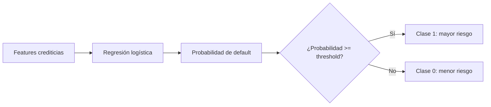
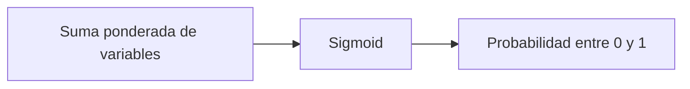
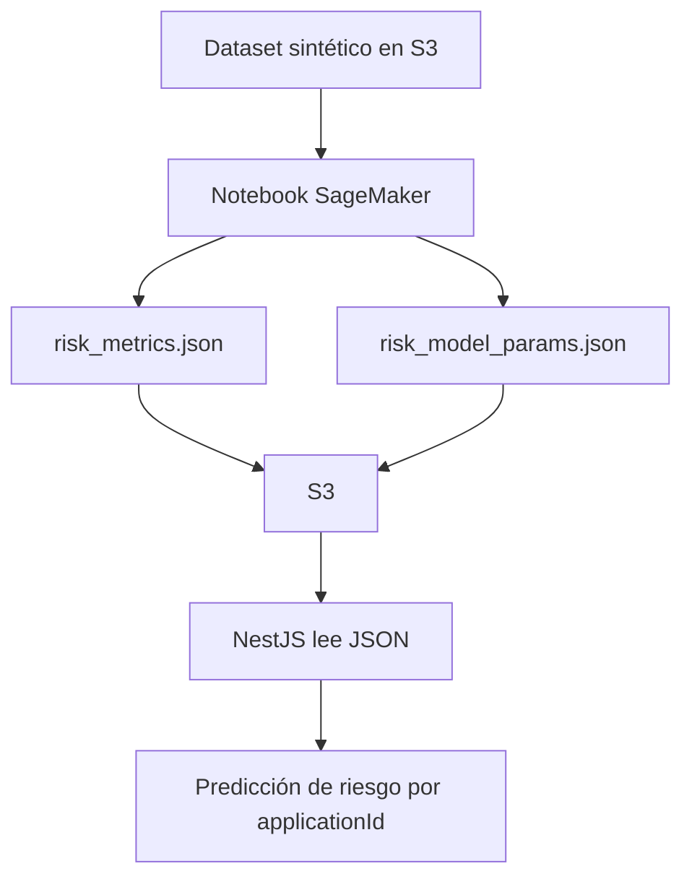

# Clase 6: Primer modelo de riesgo con regresión logística

| | |
|---|---|
| **Clase** | 6 de 11 |
| **Duración** | 3 horas |
| **Modelo** | Regresión logística para riesgo crediticio |
| **Objetivo del modelo** | Predecir probabilidad de incumplimiento |
| **Endpoints objetivo** | `GET /modulo1/clase06/models/risk/metrics`, `POST /modulo1/clase06/applications/:applicationId/risk`, `POST /modulo1/clase06/models/risk/predict` |

## Objetivos

Al terminar esta sesión podrás:

- Explicar qué es un modelo de clasificación de riesgo.
- Entender conceptualmente cómo funciona una regresión logística.
- Entender términos como `features`, `target`, `label`, `training`, `test`, `probability`, `threshold`, `coefficients`, `intercept`, `scaler`, `AUC`, `precision` y `recall`.
- Ver con un ejemplo simple cómo un modelo aprende que una variable pesa más que otras.
- Identificar los datos mínimos que necesitamos leer desde documentos para usar el modelo de riesgo.
- Crear un dataset sintético con reglas de negocio razonables.
- Entrenar y probar el modelo en un notebook de SageMaker.
- Generar `risk_metrics.json` y `risk_model_params.json` desde el notebook.
- Subir esos JSON a S3 para que NestJS pueda usarlos.
- Probar si un applicant es riesgoso desde NestJS usando las features creadas en Clase 5.
- Entender que el entrenamiento desde NestJS es posible, pero queda fuera de esta práctica por restricciones de quotas.

---

## Parte teórica

### 1. Qué problema resolveremos

En Clase 5 creamos variables listas para modelos:

```json
{
  "debt_to_income_ratio": 0.2118,
  "loan_to_value_ratio": 0.75,
  "payment_to_income_ratio": 0.3529,
  "expense_to_income_ratio": 0.4941,
  "total_obligations_to_income_ratio": 1.0588,
  "credit_history_score": 80
}
```

En Clase 6 usaremos esas variables para responder:

```txt
¿Esta solicitud tiene mayor probabilidad de incumplimiento?
```

Este es un problema de **clasificación binaria**.

```txt
Clase 0: menor riesgo
Clase 1: mayor riesgo
```

El modelo no aprueba ni rechaza créditos. Solo devuelve una señal:

```json
{
  "default_probability": 0.27,
  "risk_label": "LOW"
}
```

### Demostración inicial: el modelo del paraguas

Antes de entrar al crédito, haremos una mini demostración con el ejemplo de Clase 5:

```txt
¿Debería llevar paraguas?
```

Un alumno preguntó algo muy importante:

> "¿Qué pasa si una variable afecta mucho al modelo?"

Para responderlo, entrenaremos un modelo simple donde `rain_probability` tiene una señal más fuerte que las demás variables.

Variables:

| Feature | Qué representa |
|---------|----------------|
| `rain_probability` | Probabilidad estimada de lluvia |
| `humidity` | Humedad |
| `cloudiness` | Nubosidad |
| `wind_speed` | Velocidad del viento |
| `is_rainy_season` | Si estamos en estación lluviosa |

La idea que queremos demostrar:

```txt
Si rain_probability cambia mucho y todo lo demás queda casi igual,
el modelo debería cambiar fuerte su probabilidad de "llevar paraguas".
```

### Qué hace el script de paraguas

El archivo `train_umbrella_logistic_demo.py` hace todo en pequeño para que se vea completo:

1. Crea un dataset sintético de **800 registros**.
2. Cada registro representa un día simulado.
3. Cada día tiene estas columnas:

```txt
rain_probability
humidity
cloudiness
wind_speed
is_rainy_season
take_umbrella
```

La columna que queremos predecir es:

```txt
take_umbrella
```

Donde:

```txt
0 -> no llevar paraguas
1 -> llevar paraguas
```

El script genera los datos con una regla intencional:

```txt
rain_probability influye más fuerte que las demás variables.
```

En otras palabras, no estamos creando datos totalmente aleatorios. Estamos creando un mundo didáctico donde la probabilidad de lluvia tiene mucho peso.

Después el script entrena una regresión logística:

```txt
800 días simulados -> StandardScaler -> LogisticRegression -> coeficientes -> predicciones
```

Qué hace cada parte:

| Parte | Qué hace |
|-------|----------|
| `make_dataset()` | crea los 800 días simulados |
| `StandardScaler()` | pone las variables en escalas comparables |
| `LogisticRegression()` | aprende pesos para decidir si llevar paraguas |
| `model.fit(...)` | entrena el modelo con los datos |
| `coef_` | muestra qué peso aprendió para cada variable |
| `predict_proba(...)` | devuelve probabilidad de llevar paraguas |

Esta demo se ejecuta dentro de un notebook. Puede ser el notebook de SageMaker o el notebook local en Docker.

Primero abre JupyterLab, crea una celda y ejecuta:

```python
%run train_umbrella_logistic_demo.py
```

El resultado imprimirá dos cosas en la salida de la celda:

- los coeficientes aprendidos por el modelo;
- dos predicciones donde solo cambia `rain_probability`.

La salida se verá parecido a esto:

```txt
Coeficientes aprendidos:
          feature  coefficient
 rain_probability        2.10
        humidity        0.45
      cloudiness        0.32
 is_rainy_season        0.20
      wind_speed        0.08

Mismo dia, solo cambia rain_probability:
rain_probability = 0.15 -> 0.28
rain_probability = 0.85 -> 0.91
```

Los números exactos pueden variar un poco, pero la idea debería mantenerse:

```txt
rain_probability tiene un coeficiente mayor
y al subirla la probabilidad final aumenta bastante.
```

Cómo demostrarlo:

1. Mira la tabla de coeficientes.
2. Busca la fila `rain_probability`.
3. Compara su valor absoluto contra los demás coeficientes.
4. Luego mira las dos predicciones:

```txt
rain_probability = 0.15 -> probabilidad baja/media de llevar paraguas
rain_probability = 0.85 -> probabilidad mucho más alta de llevar paraguas
```

Si `rain_probability` aparece con el coeficiente más alto o uno de los más altos, eso significa que el modelo aprendió que esa variable empuja fuerte la decisión.

Importante: como usamos `StandardScaler`, los coeficientes ya son más comparables entre sí. Por eso podemos decir: "este coeficiente pesa más que este otro" con más confianza que si las variables estuvieran en escalas muy distintas.

Eso conecta directo con crédito:

```txt
El modelo no adivina qué variable importa.
Lo aprende desde los patrones que aparecen en los datos de entrenamiento.
```

### 2. Vocabulario esencial

Antes de entrenar, necesitamos entender varios términos que aparecen mucho en machine learning.

| Concepto | Traducción práctica | Qué significa |
|----------|---------------------|---------------|
| `feature` | variable de entrada | Columna que el modelo usa para aprender |
| `target` | objetivo | Columna que queremos predecir |
| `label` | etiqueta | Valor real de la respuesta en los datos históricos |
| `training` | entrenamiento | Proceso donde el modelo aprende desde ejemplos |
| `train set` | datos de entrenamiento | Parte del dataset usada para aprender |
| `test set` | datos de prueba | Parte separada para evaluar si aprendió bien |
| `prediction` | predicción | Respuesta del modelo para un caso |
| `probability` | probabilidad | Qué tan probable considera el modelo una clase |
| `threshold` | umbral | Punto de corte para convertir probabilidad en clase |
| `coefficient` | coeficiente | Peso que el modelo asigna a una variable |
| `intercept` | intercepto | Punto base de la fórmula del modelo |
| `scaler` | escalador | Transformación para poner variables en escalas comparables |
| `metric` | métrica | Número usado para evaluar el modelo |

En esta clase:

```txt
features = variables crediticias
target = default_flag
label = 0 o 1
```

### Datos mínimos que necesita el modelo de riesgo

Para usar el modelo de regresión logística necesitamos enviarle las mismas variables con las que fue entrenado.

Estas variables no salen mágicamente: vienen de los documentos, del formulario y de la limpieza de Clase 4.

| Dato mínimo | Variable limpia que necesitamos | De dónde puede venir | Para qué sirve |
|-------------|-------------------------------|----------------------|----------------|
| Ingreso neto mensual | `net_monthly_income` | solicitud, boleta o certificado laboral | Base para comparar deuda, gastos y cuota |
| Pago mensual de deudas | `monthly_debt_payment` | reporte crediticio | Permite calcular `debt_to_income_ratio` |
| Gastos mensuales declarados | `monthly_expenses` | formulario de solicitud | Permite calcular `expense_to_income_ratio` |
| Monto solicitado | `requested_amount` | solicitud de crédito | Permite calcular LTV y cuota estimada |
| Valor del inmueble | `property_value` | solicitud, avalúo o formulario | Permite calcular `loan_to_value_ratio` |
| Plazo solicitado | `requested_term_months` | solicitud | Permite estimar `estimated_monthly_payment` |
| Cuota estimada | `estimated_monthly_payment` | cálculo interno desde monto y plazo | Permite calcular `payment_to_income_ratio` |
| Antigüedad laboral | `employment_tenure_months` | certificado laboral | Permite crear `employment_stability_score` |
| Saldo promedio bancario | `average_monthly_balance` | extracto bancario | Permite crear `banking_capacity_score` |
| Cantidad de créditos activos | `active_loan_count` | reporte crediticio | Ayuda a construir `credit_history_score` |
| Mora o pagos atrasados | `has_late_payments` | reporte crediticio | Señal fuerte para `credit_history_score` |

Con esos datos construimos features como:

| Feature del modelo | Cómo se construye |
|--------------------|-------------------|
| `debt_to_income_ratio` | deuda mensual / ingreso neto |
| `loan_to_value_ratio` | monto solicitado / valor inmueble |
| `payment_to_income_ratio` | cuota estimada / ingreso neto |
| `expense_to_income_ratio` | gastos mensuales / ingreso neto |
| `total_obligations_to_income_ratio` | deuda + gastos + nueva cuota / ingreso neto |
| `employment_stability_score` | score desde meses de antigüedad laboral |
| `banking_capacity_score` | score desde saldo promedio relativo al ingreso |
| `credit_history_score` | score desde mora y créditos activos |

Variables finales que el modelo espera recibir sí o sí:

```txt
debt_to_income_ratio
loan_to_value_ratio
payment_to_income_ratio
expense_to_income_ratio
total_obligations_to_income_ratio
employment_stability_score
banking_capacity_score
credit_history_score
```

Punto clave:

> El modelo recibe features, pero el sistema necesita documentos para poder construir esas features.

### 3. Clasificación, regresión y clustering

En machine learning hay varios tipos de problemas.

| Tipo | Pregunta que responde | Ejemplo |
|------|------------------------|---------|
| Clasificación | ¿A qué clase pertenece? | Riesgo alto o bajo |
| Regresión | ¿Qué número esperamos? | Monto recomendado |
| Clustering | ¿Qué grupos aparecen naturalmente? | Segmentos de clientes |

En esta clase usamos clasificación:

```txt
Entrada: variables crediticias
Salida: probabilidad de default
```

En Clase 7 usaremos regresión para recomendar un monto.

---

## 4. Qué es regresión logística

La regresión logística se llama "regresión", pero se usa mucho para **clasificación binaria**.

Sirve para preguntas con dos clases:

- sí / no;
- fraude / no fraude;
- spam / no spam;
- mayor riesgo / menor riesgo;
- incumple / no incumple.

La regresión logística no devuelve primero una palabra. Devuelve una probabilidad.

```txt
Probabilidad de default = 0.73
```

Luego usamos un umbral:

```txt
Si probabilidad >= 0.50 -> mayor riesgo
Si probabilidad < 0.50 -> menor riesgo
```



### Cómo funciona conceptualmente

Imagina que el modelo recibe estas variables:

```json
{
  "debt_to_income_ratio": 0.50,
  "loan_to_value_ratio": 0.90,
  "payment_to_income_ratio": 0.45,
  "expense_to_income_ratio": 0.55,
  "total_obligations_to_income_ratio": 1.50,
  "employment_stability_score": 35,
  "banking_capacity_score": 40,
  "credit_history_score": 45
}
```

El modelo hace tres ideas simples:

1. Mira cada variable.
2. Le asigna un peso a cada variable.
3. Combina todo para producir una probabilidad entre 0 y 1.

En lenguaje simple:

```txt
Variables que aumentan riesgo empujan la probabilidad hacia arriba.
Variables que reducen riesgo empujan la probabilidad hacia abajo.
```

Ejemplo conceptual:

| Variable | Valor | Efecto esperado |
|----------|-------|-----------------|
| `debt_to_income_ratio` alto | 0.50 | sube riesgo |
| `loan_to_value_ratio` alto | 0.90 | sube riesgo |
| `payment_to_income_ratio` alto | 0.45 | sube riesgo |
| `expense_to_income_ratio` alto | 0.55 | sube riesgo |
| `total_obligations_to_income_ratio` alto | 1.50 | sube riesgo |
| `employment_stability_score` bajo | 35 | sube riesgo |
| `credit_history_score` bajo | 45 | sube riesgo |

Otro caso:

| Variable | Valor | Efecto esperado |
|----------|-------|-----------------|
| `debt_to_income_ratio` bajo | 0.18 | baja riesgo |
| `loan_to_value_ratio` moderado | 0.65 | baja riesgo |
| `payment_to_income_ratio` bajo | 0.20 | baja riesgo |
| `expense_to_income_ratio` moderado | 0.35 | baja riesgo |
| `total_obligations_to_income_ratio` moderado | 0.73 | baja riesgo |
| `employment_stability_score` alto | 100 | baja riesgo |
| `credit_history_score` alto | 95 | baja riesgo |

### Qué son los coeficientes

Un coeficiente es el peso aprendido para una variable.

Ejemplo inventado:

| Feature | Coeficiente | Interpretación simple |
|---------|-------------|-----------------------|
| `debt_to_income_ratio` | `+1.8` | Si sube, aumenta el riesgo |
| `loan_to_value_ratio` | `+1.2` | Si sube, aumenta el riesgo |
| `total_obligations_to_income_ratio` | `+1.5` | Si sube, aumenta el riesgo |
| `credit_history_score` | `-0.9` | Si sube, reduce el riesgo |
| `employment_stability_score` | `-0.6` | Si sube, reduce el riesgo |

Signo positivo:

```txt
Más valor -> más probabilidad de clase 1
```

Signo negativo:

```txt
Más valor -> menos probabilidad de clase 1
```

En nuestro caso, clase 1 significa mayor riesgo o `default_flag = 1`.

### Qué es la función sigmoid

La regresión logística necesita convertir un número cualquiera en una probabilidad entre 0 y 1.

Para eso usa una función llamada `sigmoid`.

```txt
número muy negativo -> probabilidad cercana a 0
número cercano a 0 -> probabilidad cercana a 0.5
número muy positivo -> probabilidad cercana a 1
```



No necesitas memorizar la fórmula, pero sí la idea:

> La sigmoid convierte el puntaje interno del modelo en probabilidad.

### Qué es el threshold

El threshold, o umbral, convierte probabilidad en clase.

Si usamos `0.50`:

| Probabilidad | Clase |
|--------------|-------|
| `0.18` | menor riesgo |
| `0.49` | menor riesgo |
| `0.50` | mayor riesgo |
| `0.82` | mayor riesgo |

En un banco real, ese umbral no se elige al azar. Se ajusta según política, apetito de riesgo, regulación y costo de equivocarse.

En el curso usamos `0.50` para aprender el flujo.

---

## 5. Cómo se crearon los datos sintéticos

No tenemos miles de expedientes reales con resultado histórico. Por eso usamos un dataset sintético.

Pero no queremos números aleatorios sin sentido. Queremos datos generados con una lógica razonable.

El archivo usado es:

```txt
generate_synthetic_mortgage_dataset.py
```

Este script crea solicitudes de crédito simuladas con columnas como:

- ingreso neto mensual;
- deuda mensual;
- valor del inmueble;
- monto solicitado;
- plazo solicitado;
- cantidad de créditos activos;
- mora previa;
- antigüedad laboral;
- saldo promedio;
- ratios y scores;
- `default_flag`;
- `recommended_amount`.

### Relaciones que forzamos en los datos

El script está construido para que ciertas relaciones tengan sentido:

| Regla de negocio simulada | Efecto esperado |
|---------------------------|-----------------|
| Más deuda sobre ingreso | más probabilidad de default |
| Más cuota sobre ingreso | más probabilidad de default |
| Mayor LTV | más probabilidad de default |
| Mora previa | más probabilidad de default |
| Muchos créditos activos | más probabilidad de default |
| Más antigüedad laboral | menos probabilidad de default |
| Mejor historial | menos probabilidad de default |
| Mejor capacidad bancaria | menos probabilidad de default |

Ejemplo:

```txt
Si una persona tiene mucha deuda, poca estabilidad y mora previa,
el script tiende a marcar mayor probabilidad de default.
```

Otro ejemplo:

```txt
Si una persona tiene bajo endeudamiento, buen historial y estabilidad laboral,
el script tiende a marcar menor probabilidad de default.
```

### Por qué esto importa

Si entrenamos con datos completamente aleatorios, el modelo no puede aprender una relación útil.

```txt
Datos sin lógica -> modelo sin lógica
```

Si entrenamos con datos que tienen patrones razonables, podemos verificar que el modelo aprendió esos patrones.

```txt
Datos con señales -> modelo capaz de responder a esas señales
```

Esto sigue siendo un laboratorio. No representa una política real de crédito.

### Cómo verificaremos que el modelo aprendió

Después de entrenar, probaremos dos casos:

Caso de menor riesgo:

```json
{
  "debt_to_income_ratio": 0.18,
  "loan_to_value_ratio": 0.60,
  "payment_to_income_ratio": 0.20,
  "expense_to_income_ratio": 0.35,
  "total_obligations_to_income_ratio": 0.73,
  "employment_stability_score": 100,
  "banking_capacity_score": 90,
  "credit_history_score": 95
}
```

Caso de mayor riesgo:

```json
{
  "debt_to_income_ratio": 0.62,
  "loan_to_value_ratio": 0.95,
  "payment_to_income_ratio": 0.55,
  "expense_to_income_ratio": 0.65,
  "total_obligations_to_income_ratio": 1.82,
  "employment_stability_score": 35,
  "banking_capacity_score": 30,
  "credit_history_score": 40
}
```

Esperamos que el segundo caso tenga mayor `default_probability`.

---

## Parte práctica

La práctica tendrá este flujo principal:

1. Notebook de SageMaker: entrenar y probar el modelo.
2. S3: guardar `risk_metrics.json` y `risk_model_params.json`.
3. NestJS: leer esos JSON y verificar si un applicant es riesgoso.

El entrenamiento desde NestJS con SageMaker Training Jobs es posible, pero por ahora lo dejamos como explicación conceptual porque depende de quotas de SageMaker.



### 1. Prepara el dataset en S3

Primero genera el CSV sintético y súbelo al bucket del curso.

Desde la raíz del proyecto en macOS o Linux:

```bash
python3 generate_synthetic_mortgage_dataset.py \
  --rows 2000 \
  --output synthetic_mortgage_dataset.csv

aws s3 cp synthetic_mortgage_dataset.csv \
  s3://TU_BUCKET/synthetic_mortgage_dataset.csv
```

Si usas el bucket docente:

```bash
aws s3 cp synthetic_mortgage_dataset.csv \
  s3://docente-980921750553-us-east-1-an/synthetic_mortgage_dataset.csv
```

### 2. Abre un notebook de SageMaker

En SageMaker abre el notebook en **JupyterLab**.

Usaremos el notebook para:

- leer el CSV desde S3;
- entrenar la regresión logística;
- generar `risk_metrics.json`;
- generar `risk_model_params.json`;
- subir ambos JSON a S3.

### 3. Celda 0 — instala dependencias

Ejecuta esta celda primero:

```python
%pip install --quiet scikit-learn pandas
```

No hace falta reiniciar el kernel.

El CSV tendrá columnas como:

```txt
debt_to_income_ratio
loan_to_value_ratio
payment_to_income_ratio
expense_to_income_ratio
total_obligations_to_income_ratio
employment_stability_score
banking_capacity_score
credit_history_score
default_flag
recommended_amount
```

Para esta clase usaremos `default_flag`.

```txt
default_flag = 0 -> menor riesgo
default_flag = 1 -> mayor riesgo
```

### 4. Celda 1 — imports y configuración S3

```python
import io
import json

import boto3
import pandas as pd
from sklearn.linear_model import LogisticRegression
from sklearn.metrics import (
    confusion_matrix,
    precision_score,
    recall_score,
    roc_auc_score,
)
from sklearn.model_selection import train_test_split
from sklearn.pipeline import Pipeline
from sklearn.preprocessing import StandardScaler

BUCKET = "docente-980921750553-us-east-1-an"
CSV_KEY = "synthetic_mortgage_dataset.csv"
METRICS_KEY = "ml/metrics/risk_metrics.json"
MODEL_PARAMS_KEY = "ml/models/risk/risk_model_params.json"

FEATURES = [
    "debt_to_income_ratio",
    "loan_to_value_ratio",
    "payment_to_income_ratio",
    "expense_to_income_ratio",
    "total_obligations_to_income_ratio",
    "employment_stability_score",
    "banking_capacity_score",
    "credit_history_score",
]

s3 = boto3.client("s3")
print("Dataset:", f"s3://{BUCKET}/{CSV_KEY}")
print("Metrics:", f"s3://{BUCKET}/{METRICS_KEY}")
print("Params:", f"s3://{BUCKET}/{MODEL_PARAMS_KEY}")
```

### 5. Celda 2 — leer CSV desde S3

```python
response = s3.get_object(Bucket=BUCKET, Key=CSV_KEY)
df = pd.read_csv(io.BytesIO(response["Body"].read()))

print("Rows:", len(df))
df.head()
```

Revisa distribución de la etiqueta:

```python
df["default_flag"].value_counts(normalize=True)
```

Revisa las variables principales:

```python
df[[
    "debt_to_income_ratio",
    "loan_to_value_ratio",
    "payment_to_income_ratio",
    "expense_to_income_ratio",
    "total_obligations_to_income_ratio",
    "employment_stability_score",
    "banking_capacity_score",
    "credit_history_score",
    "default_flag",
]].describe()
```

Compara promedios por clase:

```python
df.groupby("default_flag")[[
    "debt_to_income_ratio",
    "loan_to_value_ratio",
    "payment_to_income_ratio",
    "expense_to_income_ratio",
    "total_obligations_to_income_ratio",
    "employment_stability_score",
    "banking_capacity_score",
    "credit_history_score",
]].mean()
```

Aquí deberías observar algo importante:

```txt
Los casos con default_flag = 1 deberían tener más endeudamiento
y peores scores en promedio.
```

### 6. Celda 3 — entrenar regresión logística

```python
X = df[FEATURES]
y = df["default_flag"]

X_train, X_test, y_train, y_test = train_test_split(
    X,
    y,
    test_size=0.2,
    random_state=42,
    stratify=y,
)

model = Pipeline([
    ("scaler", StandardScaler()),
    ("logistic", LogisticRegression(class_weight="balanced", max_iter=1000)),
])

model.fit(X_train, y_train)
print("Model trained.")
```

Qué pasó aquí:

- `FEATURES`: columnas de entrada;
- `X`: tabla con variables;
- `y`: respuesta real;
- `train_test_split`: separa datos de entrenamiento y prueba;
- `StandardScaler`: pone variables en escalas comparables;
- `LogisticRegression`: modelo de clasificación;
- `fit`: entrena el modelo.

### 7. Celda 4 — evaluar el modelo

```python
probabilities = model.predict_proba(X_test)[:, 1]
predictions = (probabilities >= 0.5).astype(int)

auc = roc_auc_score(y_test, probabilities)
precision = precision_score(y_test, predictions)
recall = recall_score(y_test, predictions)
matrix = confusion_matrix(y_test, predictions)

print("AUC:", round(auc, 4))
print("Precision:", round(precision, 4))
print("Recall:", round(recall, 4))
print(matrix)
```

Conceptos:

| Métrica | Qué significa |
|---------|---------------|
| AUC | Qué tan bien separa casos de menor y mayor riesgo |
| Precision | De los casos marcados como riesgo, cuántos realmente eran riesgo |
| Recall | De los casos de riesgo reales, cuántos detectó |
| Matriz de confusión | Tabla de aciertos y errores |

Matriz de confusión:

```txt
[[verdaderos_bajo_riesgo, falsos_alto_riesgo],
 [falsos_bajo_riesgo, verdaderos_alto_riesgo]]
```

### 8. Celda 5 — probar dos casos extremos

```python
low_risk = pd.DataFrame([{
    "debt_to_income_ratio": 0.18,
    "loan_to_value_ratio": 0.60,
    "payment_to_income_ratio": 0.20,
    "expense_to_income_ratio": 0.35,
    "total_obligations_to_income_ratio": 0.73,
    "employment_stability_score": 100,
    "banking_capacity_score": 90,
    "credit_history_score": 95,
}])

high_risk = pd.DataFrame([{
    "debt_to_income_ratio": 0.62,
    "loan_to_value_ratio": 0.95,
    "payment_to_income_ratio": 0.55,
    "expense_to_income_ratio": 0.65,
    "total_obligations_to_income_ratio": 1.82,
    "employment_stability_score": 35,
    "banking_capacity_score": 30,
    "credit_history_score": 40,
}])

print("Low risk probability:", model.predict_proba(low_risk)[0][1])
print("High risk probability:", model.predict_proba(high_risk)[0][1])
```

La probabilidad del segundo caso debería ser mayor.

### 9. Celda 6 — construir los JSON para NestJS

NestJS no abrirá un archivo `.joblib`. Para esta clase usará un JSON con:

- features usadas por el modelo;
- medias del `StandardScaler`;
- escalas del `StandardScaler`;
- coeficientes;
- intercepto;
- threshold.

Ese JSON es `risk_model_params.json`.

```python
def ks_statistic(y_true, y_score):
    data = pd.DataFrame({"y": y_true, "score": y_score}).sort_values("score")
    good = (data["y"] == 0).sum()
    bad = (data["y"] == 1).sum()
    data["cum_good"] = (data["y"] == 0).cumsum() / max(good, 1)
    data["cum_bad"] = (data["y"] == 1).cumsum() / max(bad, 1)
    return float((data["cum_bad"] - data["cum_good"]).abs().max())


scaler = model.named_steps["scaler"]
logistic = model.named_steps["logistic"]

metrics = {
    "model_type": "logistic_regression_classifier",
    "target": "default_flag",
    "features": FEATURES,
    "auc": round(float(auc), 4),
    "gini": round(float(2 * auc - 1), 4),
    "ks": round(ks_statistic(y_test, probabilities), 4),
    "precision": round(float(precision), 4),
    "recall": round(float(recall), 4),
    "confusion_matrix": matrix.tolist(),
}

model_params = {
    "model_type": "logistic_regression_classifier",
    "target": "default_flag",
    "features": FEATURES,
    "threshold": 0.5,
    "scaler": {
        "mean": {
            name: float(value)
            for name, value in zip(FEATURES, scaler.mean_)
        },
        "scale": {
            name: float(value)
            for name, value in zip(FEATURES, scaler.scale_)
        },
    },
    "coefficients": {
        name: float(value)
        for name, value in zip(FEATURES, logistic.coef_[0])
    },
    "intercept": float(logistic.intercept_[0]),
}

print(json.dumps(metrics, indent=2))
print(json.dumps(model_params, indent=2))
```

`risk_model_params.json` tendrá esta forma:

```json
{
  "model_type": "logistic_regression_classifier",
  "target": "default_flag",
  "features": [
    "debt_to_income_ratio",
    "loan_to_value_ratio",
    "payment_to_income_ratio",
    "expense_to_income_ratio",
    "total_obligations_to_income_ratio",
    "employment_stability_score",
    "banking_capacity_score",
    "credit_history_score"
  ],
  "threshold": 0.5,
  "scaler": {
    "mean": {},
    "scale": {}
  },
  "coefficients": {},
  "intercept": -0.15
}
```

### 10. Celda 7 — subir métricas y modelo a S3

```python
def upload_json(key, payload):
    s3.put_object(
        Bucket=BUCKET,
        Key=key,
        Body=json.dumps(payload, indent=2).encode("utf-8"),
        ContentType="application/json",
    )
    print(f"Uploaded s3://{BUCKET}/{key}")


upload_json(METRICS_KEY, metrics)
upload_json(MODEL_PARAMS_KEY, model_params)
```

Con eso ya puedes usar:

```txt
GET  /modulo1/clase06/models/risk/metrics
POST /modulo1/clase06/applications/:applicationId/risk
```

La idea es:

```txt
Notebook SageMaker -> JSON en S3 -> predicción en NestJS
```

### 11. Celda 8 — verificar lectura desde S3

```python
for key in [METRICS_KEY, MODEL_PARAMS_KEY]:
    obj = s3.get_object(Bucket=BUCKET, Key=key)
    print(key)
    print(obj["Body"].read().decode("utf-8")[:300], "...\n")
```

### 12. Variables de entorno

NestJS ya no entrenará el modelo en esta práctica. Solo leerá los JSON generados por el notebook de SageMaker y guardados en S3.

Agrega a `.env`:

```env
SAGEMAKER_BUCKET=TU_BUCKET
SAGEMAKER_RISK_METRICS_KEY=ml/metrics/risk_metrics.json
SAGEMAKER_RISK_MODEL_PARAMS_KEY=ml/models/risk/risk_model_params.json
```

Si usas el bucket docente:

```env
SAGEMAKER_BUCKET=docente-980921750553-us-east-1-an
SAGEMAKER_RISK_METRICS_KEY=ml/metrics/risk_metrics.json
SAGEMAKER_RISK_MODEL_PARAMS_KEY=ml/models/risk/risk_model_params.json
```

No necesitamos `SAGEMAKER_ROLE_ARN` ni `SAGEMAKER_RISK_TRAINING_IMAGE` para esta práctica porque NestJS no llamará `CreateTrainingJob`.

### 13. Crea `Clase06Service`

Archivo: `src/modulo1/clase06/clase06.service.ts`

```typescript
import { Injectable, NotFoundException } from '@nestjs/common';
import { ConfigService } from '@nestjs/config';
import { GetObjectCommand, S3Client } from '@aws-sdk/client-s3';
import { InjectRepository } from '@nestjs/typeorm';
import { Repository } from 'typeorm';
import { CreditFeatureSet } from '../../entities/credit-feature-set.entity';

type RiskFeatures = {
  debt_to_income_ratio: number;
  loan_to_value_ratio: number;
  payment_to_income_ratio: number;
  expense_to_income_ratio: number;
  total_obligations_to_income_ratio: number;
  employment_stability_score: number;
  banking_capacity_score: number;
  credit_history_score: number;
};

type RiskModelParams = {
  features: (keyof RiskFeatures)[];
  threshold: number;
  scaler: {
    mean: Record<string, number>;
    scale: Record<string, number>;
  };
  coefficients: Record<string, number>;
  intercept: number;
};

@Injectable()
export class Clase06Service {
  private readonly s3: S3Client;

  constructor(
    private readonly config: ConfigService,
    @InjectRepository(CreditFeatureSet)
    private readonly featureSets: Repository<CreditFeatureSet>,
  ) {
    this.s3 = new S3Client({
      region: this.config.getOrThrow<string>('AWS_REGION'),
      credentials: {
        accessKeyId: this.config.getOrThrow<string>('AWS_ACCESS_KEY_ID'),
        secretAccessKey: this.config.getOrThrow<string>('AWS_SECRET_ACCESS_KEY'),
      },
    });
  }

  async getRiskMetrics() {
    return await this.readJson(
      this.config.getOrThrow<string>('SAGEMAKER_RISK_METRICS_KEY'),
    );
  }

  async predictApplicationRisk(applicationId: string) {
    const featureSet = await this.featureSets.findOne({
      where: { applicationId },
    });

    if (!featureSet) {
      throw new NotFoundException('Feature set not found for this application');
    }

    const features: RiskFeatures = {
      debt_to_income_ratio: Number(featureSet.debtToIncomeRatio),
      loan_to_value_ratio: Number(featureSet.loanToValueRatio),
      payment_to_income_ratio: Number(featureSet.paymentToIncomeRatio),
      expense_to_income_ratio: Number(featureSet.expenseToIncomeRatio),
      total_obligations_to_income_ratio: Number(
        featureSet.totalObligationsToIncomeRatio,
      ),
      employment_stability_score: Number(featureSet.employmentStabilityScore),
      banking_capacity_score: Number(featureSet.bankingCapacityScore),
      credit_history_score: Number(featureSet.creditHistoryScore),
    };

    return await this.predictRisk(features);
  }

  async predictRisk(features: RiskFeatures) {
    const model = (await this.readJson(
      this.config.getOrThrow<string>('SAGEMAKER_RISK_MODEL_PARAMS_KEY'),
    )) as RiskModelParams;

    let score = model.intercept;

    for (const featureName of model.features) {
      const rawValue = features[featureName];
      const mean = model.scaler.mean[featureName];
      const scale = model.scaler.scale[featureName] || 1;
      const coefficient = model.coefficients[featureName];
      const standardizedValue = (rawValue - mean) / scale;
      score += standardizedValue * coefficient;
    }

    const defaultProbability = 1 / (1 + Math.exp(-score));
    const threshold = model.threshold ?? 0.5;

    return {
      defaultProbability: Number(defaultProbability.toFixed(4)),
      threshold,
      riskLabel: defaultProbability >= threshold ? 'HIGH' : 'LOW',
      modelType: 'logistic_regression_classifier',
      features,
    };
  }

  private async readJson(key: string) {
    const response = await this.s3.send(
      new GetObjectCommand({
        Bucket: this.config.getOrThrow<string>('SAGEMAKER_BUCKET'),
        Key: key,
      }),
    );

    return JSON.parse(await response.Body!.transformToString());
  }
}
```

Qué hace este servicio:

- lee `risk_metrics.json` desde S3;
- lee `risk_model_params.json` desde S3;
- busca las features del applicant en `credit_feature_sets`;
- aplica la fórmula de regresión logística en NestJS;
- devuelve probabilidad y etiqueta de riesgo.

No llama a SageMaker para predecir.

### 14. Crea el controller

Archivo: `src/modulo1/clase06/clase06.controller.ts`

```typescript
import { Body, Controller, Get, Param, Post, UseGuards } from '@nestjs/common';
import { ApiKeyGuard } from '../../auth/guards/api-key.guard';
import { Clase06Service } from './clase06.service';

@Controller('modulo1/clase06')
@UseGuards(ApiKeyGuard)
export class Clase06Controller {
  constructor(private readonly clase06: Clase06Service) {}

  @Get('models/risk/metrics')
  async getRiskMetrics() {
    return await this.clase06.getRiskMetrics();
  }

  @Post('applications/:applicationId/risk')
  async predictApplicationRisk(@Param('applicationId') applicationId: string) {
    return await this.clase06.predictApplicationRisk(applicationId);
  }

  @Post('models/risk/predict')
  async predictRisk(
    @Body()
    body: {
      debt_to_income_ratio: number;
      loan_to_value_ratio: number;
      payment_to_income_ratio: number;
      expense_to_income_ratio: number;
      total_obligations_to_income_ratio: number;
      employment_stability_score: number;
      banking_capacity_score: number;
      credit_history_score: number;
    },
  ) {
    return await this.clase06.predictRisk(body);
  }
}
```

Endpoints de la clase:

| Endpoint | Uso |
|----------|-----|
| `GET /modulo1/clase06/models/risk/metrics` | Ver métricas del modelo entrenado en notebook |
| `POST /modulo1/clase06/applications/:applicationId/risk` | Evaluar riesgo de una solicitud usando features de Clase 5 |
| `POST /modulo1/clase06/models/risk/predict` | Probar manualmente con un JSON de features |

### 15. Actualiza `Modulo1Module`

Agrega:

```typescript
import { Clase06Controller } from './clase06/clase06.controller';
import { Clase06Service } from './clase06/clase06.service';
```

Luego registra:

```typescript
controllers: [
  Clase01Controller,
  Clase02Controller,
  Clase03Controller,
  Clase04Controller,
  Clase05Controller,
  Clase06Controller,
],
providers: [
  Clase01Service,
  Clase02Service,
  Clase03Service,
  Clase04Service,
  Clase05Service,
  Clase06Service,
  GlueService,
  TextractService,
],
```

Asegúrate de que `CreditFeatureSet` esté en `TypeOrmModule.forFeature([...])`, porque `Clase06Service` lo necesita para leer las variables ya generadas en Clase 5.

### 16. Prueba desde NestJS

Primero consulta métricas:

```bash
curl http://localhost:3000/modulo1/clase06/models/risk/metrics \
  -H "x-api-key: test1" \
  -H "x-api-secret: pass1"
```

Luego prueba el riesgo de un applicant real que ya tenga features en `credit_feature_sets`:

```bash
curl -X POST http://localhost:3000/modulo1/clase06/applications/APPLICATION_ID/risk \
  -H "x-api-key: test1" \
  -H "x-api-secret: pass1"
```

También puedes probar manualmente sin depender de la base de datos:

```bash
curl -X POST http://localhost:3000/modulo1/clase06/models/risk/predict \
  -H "Content-Type: application/json" \
  -H "x-api-key: test1" \
  -H "x-api-secret: pass1" \
  -d '{
    "debt_to_income_ratio": 0.62,
    "loan_to_value_ratio": 0.95,
    "payment_to_income_ratio": 0.55,
    "expense_to_income_ratio": 0.65,
    "total_obligations_to_income_ratio": 1.82,
    "employment_stability_score": 35,
    "banking_capacity_score": 30,
    "credit_history_score": 40
  }'
```

### Entrenamiento desde NestJS más adelante

Más adelante sí podríamos agregar:

```txt
POST /modulo1/clase06/sagemaker/train-risk
```

Ese endpoint llamaría `CreateTrainingJob` y generaría los mismos JSON en S3. Por ahora no lo implementamos en la práctica porque depende de quotas de SageMaker y de una imagen de entrenamiento en ECR.

## Entrega

- Captura del notebook entrenando regresión logística.
- Resultado de métricas (`AUC`, `precision`, `recall`, matriz de confusión).
- Evidencia de `risk_metrics.json`.
- Evidencia de `risk_model_params.json`.
- Evidencia de ambos archivos subidos a S3.
- Prueba desde NestJS con un caso de menor riesgo y uno de mayor riesgo.
- Explicación corta de por qué el segundo caso devuelve mayor probabilidad.

## Recursos

- [Scikit-learn LogisticRegression](https://scikit-learn.org/stable/modules/generated/sklearn.linear_model.LogisticRegression.html)
- [Scikit-learn StandardScaler](https://scikit-learn.org/stable/modules/generated/sklearn.preprocessing.StandardScaler.html)
- [Amazon SageMaker Training Jobs](https://docs.aws.amazon.com/sagemaker/latest/dg/how-it-works-training.html)
