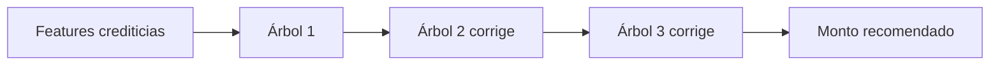

# Clase 7: Modelo de monto recomendado con XGBoost

| | |
|---|---|
| **Clase** | 7 de 11 |
| **Duración** | 3 horas |
| **Controlador** | `Clase07Controller` |
| **Endpoints** | `GET /modulo1/clase07/models/amount/metrics`, `POST /modulo1/clase07/applications/:applicationId/amount`, `POST /modulo1/clase07/models/amount/predict`, `GET /modulo1/clase07/models/compare` |

## Objetivos

Al terminar esta sesión podrás:

- Diferenciar clasificación y regresión con el mismo caso hipotecario.
- Entender qué problema resuelve el modelo de monto recomendado.
- Explicar de forma simple qué es XGBoost y cómo usa árboles.
- Entrenar un modelo XGBoost en un notebook de SageMaker.
- Generar `amount_metrics.json` y `amount_model.json`.
- Subir esos JSON a S3.
- Usar NestJS para recomendar monto a partir de las features de Clase 5.
- Comparar el modelo de riesgo de Clase 6 con el modelo de monto de Clase 7.

---

## Parte teórica

### 1. Qué responde este modelo

En Clase 6 respondimos:

```txt
¿Cuál es el riesgo de incumplimiento?
```

Eso era clasificación:

```txt
LOW / HIGH
```

En Clase 7 respondemos:

```txt
¿Qué monto recomendado tiene sentido para esta solicitud?
```

Eso es regresión:

```txt
Salida = número
```

Ejemplo:

```json
{
  "recommended_amount": 420000
}
```

El modelo no aprueba el crédito. Devuelve una recomendación numérica que luego podría combinarse con políticas de negocio.

### 2. Clasificación vs regresión

| Pregunta | Tipo de modelo | Salida |
|----------|----------------|--------|
| ¿Es riesgoso? | Clasificación | clase o probabilidad |
| ¿Cuánto recomendar? | Regresión | número |

En palabras simples:

```txt
Clasificación elige una categoría.
Regresión estima un valor.
```

### 3. Qué es XGBoost

XGBoost es un algoritmo basado en árboles de decisión.

Un árbol de decisión funciona con preguntas simples:

```txt
¿El ingreso mensual es mayor a 8000?
¿La relación deuda/ingreso es mayor a 0.45?
¿El historial crediticio es menor a 60?
```

Cada pregunta divide los casos hasta llegar a una predicción.

Ejemplo muy simple:

```txt
Si ingreso alto y deuda baja -> recomendar monto mayor
Si ingreso bajo o deuda alta -> recomendar monto menor
```

XGBoost no usa un solo árbol. Usa muchos árboles pequeños.

```txt
árbol 1 -> primera estimación
árbol 2 -> corrige errores del árbol 1
árbol 3 -> corrige errores acumulados
...
resultado final -> suma de muchos árboles
```

Eso se llama **boosting**.



### 4. Por qué XGBoost sirve para crédito

XGBoost funciona bien con datos tabulares y relaciones no lineales.

El monto recomendado puede depender de varias cosas al mismo tiempo:

- ingreso mensual;
- deuda mensual;
- gastos mensuales;
- valor del inmueble;
- monto solicitado;
- plazo;
- historial crediticio;
- capacidad bancaria;
- ratios creados en Clase 5.

No siempre hay una relación lineal simple. Por ejemplo:

```txt
Un ingreso alto ayuda,
pero si la deuda también es alta,
el monto recomendado puede bajar.
```

XGBoost puede aprender ese tipo de combinaciones.

### 5. Variables que usará el modelo

El modelo de monto usará variables limpias y features de Clase 5.

| Variable | Qué significa |
|----------|---------------|
| `net_monthly_income` | ingreso neto mensual |
| `monthly_debt_payment` | pago mensual de deudas existentes |
| `monthly_expenses` | gastos mensuales declarados |
| `property_value` | valor del inmueble |
| `requested_amount` | monto solicitado |
| `requested_term_months` | plazo solicitado |
| `estimated_monthly_payment` | cuota estimada del nuevo crédito |
| `debt_to_income_ratio` | deuda mensual / ingreso |
| `loan_to_value_ratio` | monto solicitado / valor inmueble |
| `payment_to_income_ratio` | cuota estimada / ingreso |
| `expense_to_income_ratio` | gastos / ingreso |
| `total_obligations_to_income_ratio` | deuda + gastos + nueva cuota / ingreso |
| `employment_stability_score` | score de estabilidad laboral |
| `banking_capacity_score` | score de capacidad bancaria |
| `credit_history_score` | score de historial crediticio |

La variable que queremos predecir es:

```txt
recommended_amount
```

### 6. Métricas de regresión

En Clase 6 usamos métricas de clasificación como AUC, precision y recall.

En Clase 7 usamos métricas de regresión.

| Métrica | Qué indica |
|---------|------------|
| `RMSE` | error promedio, penalizando más los errores grandes |
| `MAE` | error absoluto promedio |
| `R2` | qué tanto explica el modelo la variación del monto |

Ejemplo simple:

```txt
MAE = 18000
```

Significa:

```txt
En promedio, el modelo se equivoca por 18000 Bs.
```

No usamos AUC aquí porque AUC es para clasificación.

### 7. Qué JSON genera XGBoost

Igual que en Clase 6, guardaremos artefactos en S3.

Pero hay una diferencia:

```txt
Regresión logística -> JSON pequeño con coeficientes.
XGBoost -> JSON con muchos árboles.
```

El notebook generará:

```txt
amount_metrics.json
amount_model.json
```

`amount_metrics.json` sirve para revisar qué tan bien entrenó el modelo.

`amount_model.json` contiene los árboles de XGBoost en un formato que NestJS puede recorrer para calcular una predicción.

---

## Parte práctica

El flujo será igual al de Clase 6:

```txt
Notebook SageMaker -> genera CSV -> sube CSV a S3 -> entrena modelo -> genera JSON -> S3 -> NestJS predice
```

### 1. Abre un notebook de SageMaker

Abre el notebook en **JupyterLab**.

El notebook hará esto:

- generar el CSV sintético dentro de SageMaker;
- subir el CSV a S3;
- leer el CSV desde S3;
- entrenar XGBoost;
- evaluar métricas;
- generar `amount_metrics.json`;
- generar `amount_model.json`;
- subir ambos JSON a S3.

### 2. Celda 0 — instalar dependencias

```python
%pip install --quiet xgboost scikit-learn pandas
```

### 3. Celda 1 — imports y configuración S3

```python
import io
import json

import boto3
import numpy as np
import pandas as pd
from sklearn.metrics import mean_absolute_error, mean_squared_error, r2_score
from sklearn.model_selection import train_test_split
from xgboost import XGBRegressor

BUCKET = "docente-980921750553-us-east-1-an"
CSV_KEY = "synthetic_mortgage_dataset.csv"
AMOUNT_METRICS_KEY = "ml/metrics/amount_metrics.json"
AMOUNT_MODEL_KEY = "ml/models/amount/amount_model.json"
RISK_METRICS_KEY = "ml/metrics/risk_metrics.json"

FEATURES = [
    "net_monthly_income",
    "monthly_debt_payment",
    "monthly_expenses",
    "property_value",
    "requested_amount",
    "requested_term_months",
    "estimated_monthly_payment",
    "debt_to_income_ratio",
    "loan_to_value_ratio",
    "payment_to_income_ratio",
    "expense_to_income_ratio",
    "total_obligations_to_income_ratio",
    "employment_stability_score",
    "banking_capacity_score",
    "credit_history_score",
]

s3 = boto3.client("s3")
print("Dataset:", f"s3://{BUCKET}/{CSV_KEY}")
```

### 4. Celda 2 — generar el CSV sintético en SageMaker y subirlo a S3

En esta celda creamos el mismo dataset sintético que usamos desde la Clase 6, pero ahora directamente dentro del notebook de SageMaker.

```python
def clip(values, low, high):
    return np.minimum(np.maximum(values, low), high)


def generate_synthetic_mortgage_dataset(rows=2000, seed=42):
    rng = np.random.default_rng(seed)

    net_monthly_income = clip(rng.normal(8500, 3200, rows), 2500, 30000)
    property_value = clip(
        net_monthly_income * rng.normal(70, 18, rows),
        120000,
        1800000,
    )
    requested_amount = property_value * clip(
        rng.normal(0.72, 0.13, rows),
        0.35,
        0.98,
    )
    requested_term_months = rng.choice(
        [120, 180, 240, 300],
        rows,
        p=[0.15, 0.25, 0.45, 0.15],
    )
    monthly_debt_payment = net_monthly_income * clip(
        rng.normal(0.22, 0.14, rows),
        0,
        0.75,
    )
    monthly_expenses = net_monthly_income * clip(
        rng.normal(0.42, 0.16, rows),
        0.12,
        0.85,
    )
    active_loan_count = rng.poisson(1.2, rows)
    has_late_payments = rng.binomial(
        1,
        clip(0.08 + active_loan_count * 0.04, 0.05, 0.45),
    )
    employment_tenure_months = clip(rng.gamma(3.0, 18.0, rows), 1, 240)
    average_monthly_balance = net_monthly_income * clip(
        rng.normal(1.15, 0.9, rows),
        0.02,
        5.5,
    )

    estimated_monthly_payment = requested_amount / requested_term_months
    debt_to_income_ratio = monthly_debt_payment / net_monthly_income
    loan_to_value_ratio = requested_amount / property_value
    payment_to_income_ratio = estimated_monthly_payment / net_monthly_income
    expense_to_income_ratio = monthly_expenses / net_monthly_income
    total_obligations_to_income_ratio = (
        monthly_debt_payment + monthly_expenses + estimated_monthly_payment
    ) / net_monthly_income

    employment_stability_score = np.select(
        [
            employment_tenure_months >= 60,
            employment_tenure_months >= 24,
            employment_tenure_months >= 12,
        ],
        [100, 80, 60],
        default=35,
    )
    banking_capacity_score = np.select(
        [
            average_monthly_balance / net_monthly_income >= 3,
            average_monthly_balance / net_monthly_income >= 1,
            average_monthly_balance / net_monthly_income >= 0.3,
        ],
        [100, 75, 55],
        default=30,
    )
    credit_history_score = clip(
        100 - has_late_payments * 35 - active_loan_count * 8,
        0,
        100,
    )

    risk_signal = (
        2.4 * debt_to_income_ratio
        + 2.0 * payment_to_income_ratio
        + 1.8 * total_obligations_to_income_ratio
        + 0.8 * expense_to_income_ratio
        + 1.7 * (loan_to_value_ratio > 0.85)
        + 1.2 * has_late_payments
        + 0.5 * (active_loan_count >= 3)
        - 0.012 * employment_stability_score
        - 0.007 * banking_capacity_score
        - 0.009 * credit_history_score
        + rng.normal(0, 0.25, rows)
    )
    default_probability = 1 / (1 + np.exp(-(risk_signal - 0.9)))
    default_flag = rng.binomial(1, clip(default_probability, 0.02, 0.85))

    affordability_amount = (
        net_monthly_income * 0.35 - monthly_debt_payment
    ) * requested_term_months
    collateral_amount = property_value * 0.8
    history_factor = clip(credit_history_score / 100, 0.35, 1.0)
    recommended_amount = clip(
        np.minimum.reduce([requested_amount, affordability_amount, collateral_amount])
        * history_factor,
        0,
        requested_amount,
    )
    recommended_amount = np.round(recommended_amount / 1000) * 1000

    return pd.DataFrame(
        {
            "application_id": [f"APP-{i:06d}" for i in range(rows)],
            "net_monthly_income": np.round(net_monthly_income, 2),
            "monthly_debt_payment": np.round(monthly_debt_payment, 2),
            "monthly_expenses": np.round(monthly_expenses, 2),
            "property_value": np.round(property_value, 2),
            "requested_amount": np.round(requested_amount, 2),
            "requested_term_months": requested_term_months,
            "active_loan_count": active_loan_count,
            "has_late_payments": has_late_payments,
            "employment_tenure_months": np.round(employment_tenure_months).astype(int),
            "average_monthly_balance": np.round(average_monthly_balance, 2),
            "estimated_monthly_payment": np.round(estimated_monthly_payment, 2),
            "debt_to_income_ratio": np.round(debt_to_income_ratio, 4),
            "loan_to_value_ratio": np.round(loan_to_value_ratio, 4),
            "payment_to_income_ratio": np.round(payment_to_income_ratio, 4),
            "expense_to_income_ratio": np.round(expense_to_income_ratio, 4),
            "total_obligations_to_income_ratio": np.round(
                total_obligations_to_income_ratio,
                4,
            ),
            "employment_stability_score": employment_stability_score,
            "banking_capacity_score": banking_capacity_score,
            "credit_history_score": credit_history_score,
            "default_flag": default_flag,
            "recommended_amount": recommended_amount,
        }
    )


df = generate_synthetic_mortgage_dataset(rows=2000)

csv_buffer = io.StringIO()
df.to_csv(csv_buffer, index=False)

s3.put_object(
    Bucket=BUCKET,
    Key=CSV_KEY,
    Body=csv_buffer.getvalue().encode("utf-8"),
    ContentType="text/csv",
)

print("Rows generated:", len(df))
print("Uploaded:", f"s3://{BUCKET}/{CSV_KEY}")
df.head()
```

### 5. Celda 3 — leer dataset desde S3

```python
response = s3.get_object(Bucket=BUCKET, Key=CSV_KEY)
df = pd.read_csv(io.BytesIO(response["Body"].read()))

print("Rows:", len(df))
df[FEATURES + ["recommended_amount"]].head()
```

### 6. Celda 4 — explorar target

```python
df["recommended_amount"].describe()
```

```python
df[FEATURES + ["recommended_amount"]].corr(numeric_only=True)["recommended_amount"].sort_values(ascending=False)
```

### 7. Celda 5 — entrenar XGBoost

```python
X = df[FEATURES]
y = df["recommended_amount"]

X_train, X_test, y_train, y_test = train_test_split(
    X,
    y,
    test_size=0.2,
    random_state=42,
)

model = XGBRegressor(
    objective="reg:squarederror",
    n_estimators=180,
    max_depth=4,
    learning_rate=0.08,
    subsample=0.85,
    colsample_bytree=0.9,
    random_state=42,
)

model.fit(X_train, y_train)
print("Model trained.")
```

### 8. Celda 6 — evaluar métricas

```python
predictions = model.predict(X_test)

rmse = np.sqrt(mean_squared_error(y_test, predictions))
mae = mean_absolute_error(y_test, predictions)
r2 = r2_score(y_test, predictions)

print("RMSE:", round(float(rmse), 2))
print("MAE:", round(float(mae), 2))
print("R2:", round(float(r2), 4))
```

### 9. Celda 7 — probar dos casos

```python
low_amount_case = pd.DataFrame([{
    "net_monthly_income": 4500,
    "monthly_debt_payment": 1800,
    "monthly_expenses": 2500,
    "property_value": 350000,
    "requested_amount": 300000,
    "requested_term_months": 180,
    "estimated_monthly_payment": 1666.67,
    "debt_to_income_ratio": 0.40,
    "loan_to_value_ratio": 0.86,
    "payment_to_income_ratio": 0.37,
    "expense_to_income_ratio": 0.56,
    "total_obligations_to_income_ratio": 1.33,
    "employment_stability_score": 35,
    "banking_capacity_score": 30,
    "credit_history_score": 45,
}])

high_amount_case = pd.DataFrame([{
    "net_monthly_income": 15000,
    "monthly_debt_payment": 1200,
    "monthly_expenses": 4500,
    "property_value": 900000,
    "requested_amount": 500000,
    "requested_term_months": 240,
    "estimated_monthly_payment": 2083.33,
    "debt_to_income_ratio": 0.08,
    "loan_to_value_ratio": 0.56,
    "payment_to_income_ratio": 0.14,
    "expense_to_income_ratio": 0.30,
    "total_obligations_to_income_ratio": 0.52,
    "employment_stability_score": 100,
    "banking_capacity_score": 90,
    "credit_history_score": 95,
}])

print("Low amount case:", round(float(model.predict(low_amount_case)[0]), 2))
print("High amount case:", round(float(model.predict(high_amount_case)[0]), 2))
```

### 10. Celda 8 — crear JSON de métricas y modelo

```python
def parse_base_score(model):
    config = json.loads(model.get_booster().save_config())
    raw_base_score = config["learner"]["learner_model_param"]["base_score"]
    return float(str(raw_base_score).strip("[]"))


booster = model.get_booster()

amount_metrics = {
    "model_type": "xgboost_regressor",
    "target": "recommended_amount",
    "features": FEATURES,
    "rmse": round(float(rmse), 2),
    "mae": round(float(mae), 2),
    "r2": round(float(r2), 4),
}

amount_model = {
    "model_type": "xgboost_regressor_tree_dump",
    "target": "recommended_amount",
    "features": FEATURES,
    "base_score": parse_base_score(model),
    "trees": [
        json.loads(tree)
        for tree in booster.get_dump(dump_format="json")
    ],
    "prediction_clip": {
        "min": 0,
    },
}

print(json.dumps(amount_metrics, indent=2))
print("Trees:", len(amount_model["trees"]))
```

### 11. Celda 9 — subir JSON a S3

```python
def upload_json(key, payload):
    s3.put_object(
        Bucket=BUCKET,
        Key=key,
        Body=json.dumps(payload, indent=2).encode("utf-8"),
        ContentType="application/json",
    )
    print(f"Uploaded s3://{BUCKET}/{key}")


upload_json(AMOUNT_METRICS_KEY, amount_metrics)
upload_json(AMOUNT_MODEL_KEY, amount_model)
```

### 12. Variables de entorno

Agrega a `.env`:

```env
SAGEMAKER_AMOUNT_METRICS_KEY=ml/metrics/amount_metrics.json
SAGEMAKER_AMOUNT_MODEL_KEY=ml/models/amount/amount_model.json
```

Se reutiliza:

```env
SAGEMAKER_BUCKET=docente-980921750553-us-east-1-an
SAGEMAKER_RISK_METRICS_KEY=ml/metrics/risk_metrics.json
```

### 13. Crea `Clase07Service`

Archivo: `src/modulo1/clase07/clase07.service.ts`

```typescript
import { GetObjectCommand, S3Client } from '@aws-sdk/client-s3';
import { Injectable, NotFoundException } from '@nestjs/common';
import { ConfigService } from '@nestjs/config';
import { InjectRepository } from '@nestjs/typeorm';
import { Repository } from 'typeorm';
import { CreditFeatureSet } from '../../entities/credit-feature-set.entity';

type AmountFeatures = Record<string, number>;

type XGBoostTreeNode = {
  nodeid: number;
  split?: string;
  split_condition?: number;
  yes?: number;
  no?: number;
  missing?: number;
  children?: XGBoostTreeNode[];
  leaf?: number;
};

type AmountModelJson = {
  model_type: 'xgboost_regressor_tree_dump';
  target: 'recommended_amount';
  features: string[];
  base_score: number;
  trees: XGBoostTreeNode[];
  prediction_clip?: {
    min?: number;
    max?: number;
  };
};

@Injectable()
export class Clase07Service {
  private readonly s3: S3Client;

  constructor(
    private readonly config: ConfigService,
    @InjectRepository(CreditFeatureSet)
    private readonly featureSets: Repository<CreditFeatureSet>,
  ) {
    this.s3 = new S3Client({
      region: this.config.getOrThrow<string>('AWS_REGION'),
      credentials: {
        accessKeyId: this.config.getOrThrow<string>('AWS_ACCESS_KEY_ID'),
        secretAccessKey: this.config.getOrThrow<string>('AWS_SECRET_ACCESS_KEY'),
      },
    });
  }

  async getAmountMetrics() {
    return await this.readJson(
      this.config.getOrThrow<string>('SAGEMAKER_AMOUNT_METRICS_KEY'),
    );
  }

  async compareModels() {
    return {
      riskModel: await this.readJson(
        this.config.getOrThrow<string>('SAGEMAKER_RISK_METRICS_KEY'),
      ),
      amountModel: await this.getAmountMetrics(),
    };
  }

  async recommendApplicationAmount(applicationId: string) {
    const featureSet = await this.featureSets.findOne({
      where: { applicationId },
    });

    if (!featureSet) {
      throw new NotFoundException('Feature set not found for this application');
    }

    const payload = featureSet.featuresPayload ?? {};
    const features = this.pickAmountFeatures({
      ...payload,
      debt_to_income_ratio: featureSet.debtToIncomeRatio,
      loan_to_value_ratio: featureSet.loanToValueRatio,
      payment_to_income_ratio: featureSet.paymentToIncomeRatio,
      expense_to_income_ratio: featureSet.expenseToIncomeRatio,
      total_obligations_to_income_ratio:
        featureSet.totalObligationsToIncomeRatio,
      employment_stability_score: featureSet.employmentStabilityScore,
      banking_capacity_score: featureSet.bankingCapacityScore,
      credit_history_score: featureSet.creditHistoryScore,
    });

    return await this.predictAmount(features);
  }

  async predictAmount(features: AmountFeatures) {
    const model = (await this.readJson(
      this.config.getOrThrow<string>('SAGEMAKER_AMOUNT_MODEL_KEY'),
    )) as AmountModelJson;

    let prediction = model.base_score;
    for (const tree of model.trees) {
      prediction += this.evaluateTree(tree, features);
    }

    const min = model.prediction_clip?.min;
    const max = model.prediction_clip?.max;
    if (typeof min === 'number') {
      prediction = Math.max(min, prediction);
    }
    if (typeof max === 'number') {
      prediction = Math.min(max, prediction);
    }

    return {
      recommendedAmount: Math.round(prediction),
      modelType: model.model_type,
      features,
    };
  }

  private pickAmountFeatures(source: Record<string, unknown>) {
    const names = [
      'net_monthly_income',
      'monthly_debt_payment',
      'monthly_expenses',
      'property_value',
      'requested_amount',
      'requested_term_months',
      'estimated_monthly_payment',
      'debt_to_income_ratio',
      'loan_to_value_ratio',
      'payment_to_income_ratio',
      'expense_to_income_ratio',
      'total_obligations_to_income_ratio',
      'employment_stability_score',
      'banking_capacity_score',
      'credit_history_score',
    ];

    return Object.fromEntries(
      names.map((name) => [name, this.toNumber(source[name])]),
    );
  }

  private evaluateTree(node: XGBoostTreeNode, features: AmountFeatures): number {
    if (typeof node.leaf === 'number') {
      return node.leaf;
    }

    if (!node.children || !node.split) {
      throw new NotFoundException('Invalid amount model tree');
    }

    const rawValue = features[node.split];
    const nextNodeId =
      !Number.isFinite(rawValue) && node.missing !== undefined
        ? node.missing
        : rawValue < (node.split_condition ?? 0)
          ? node.yes
          : node.no;

    const child = node.children.find(
      (candidate) => candidate.nodeid === nextNodeId,
    );
    if (!child) {
      throw new NotFoundException('Invalid amount model tree path');
    }

    return this.evaluateTree(child, features);
  }

  private async readJson(key: string) {
    const response = await this.s3.send(
      new GetObjectCommand({
        Bucket: this.config.getOrThrow<string>('SAGEMAKER_BUCKET'),
        Key: key,
      }),
    );

    return JSON.parse(await response.Body!.transformToString());
  }

  private toNumber(value: unknown) {
    const numberValue = Number(value);
    if (!Number.isFinite(numberValue)) {
      throw new NotFoundException('Application has incomplete amount features');
    }
    return numberValue;
  }
}
```

Qué hace este servicio:

- lee `amount_metrics.json` y `amount_model.json` desde S3;
- busca las features del applicant en `credit_feature_sets` (Clase 5);
- recorre cada árbol del JSON de XGBoost y suma las hojas;
- devuelve `recommendedAmount` redondeado;
- en `compareModels` junta métricas de riesgo (Clase 6) y de monto.

No llama a SageMaker para predecir.

### 14. Crea el controller

Archivo: `src/modulo1/clase07/clase07.controller.ts`

```typescript
import { Body, Controller, Get, Param, Post, UseGuards } from '@nestjs/common';
import { ApiKeyGuard } from '../../auth/guards/api-key.guard';
import { Clase07Service } from './clase07.service';

@Controller('modulo1/clase07')
@UseGuards(ApiKeyGuard)
export class Clase07Controller {
  constructor(private readonly clase07: Clase07Service) {}

  @Get('models/amount/metrics')
  async getAmountMetrics() {
    return await this.clase07.getAmountMetrics();
  }

  @Get('models/compare')
  async compareModels() {
    return await this.clase07.compareModels();
  }

  @Post('applications/:applicationId/amount')
  async recommendApplicationAmount(@Param('applicationId') applicationId: string) {
    return await this.clase07.recommendApplicationAmount(applicationId);
  }

  @Post('models/amount/predict')
  async predictAmount(@Body() body: Record<string, number>) {
    return await this.clase07.predictAmount(body);
  }
}
```

Endpoints de la clase:

| Endpoint | Uso |
|----------|-----|
| `GET /modulo1/clase07/models/amount/metrics` | Ver métricas del modelo de monto |
| `POST /modulo1/clase07/applications/:applicationId/amount` | Recomendar monto para una solicitud real |
| `POST /modulo1/clase07/models/amount/predict` | Probar monto con features manuales |
| `GET /modulo1/clase07/models/compare` | Comparar métricas riesgo vs monto |

### 15. Actualiza `Modulo1Module`

Agrega:

```typescript
import { Clase07Controller } from './clase07/clase07.controller';
import { Clase07Service } from './clase07/clase07.service';
```

Luego registra:

```typescript
controllers: [
  Clase01Controller,
  Clase02Controller,
  Clase03Controller,
  Clase04Controller,
  Clase05Controller,
  Clase06Controller,
  Clase07Controller,
],
providers: [
  Clase01Service,
  Clase02Service,
  Clase03Service,
  Clase04Service,
  Clase05Service,
  Clase06Service,
  Clase07Service,
  GlueService,
  TextractService,
],
```

`CreditFeatureSet` ya debería estar en `TypeOrmModule.forFeature([...])` desde Clase 5.

### 16. Probar desde NestJS

Métricas:

```bash
curl http://localhost:3000/modulo1/clase07/models/amount/metrics \
  -H "x-api-key: test1" \
  -H "x-api-secret: pass1"
```

Recomendar monto para una solicitud real:

```bash
curl -X POST http://localhost:3000/modulo1/clase07/applications/APPLICATION_ID/amount \
  -H "x-api-key: test1" \
  -H "x-api-secret: pass1"
```

Probar manualmente:

```bash
curl -X POST http://localhost:3000/modulo1/clase07/models/amount/predict \
  -H "Content-Type: application/json" \
  -H "x-api-key: test1" \
  -H "x-api-secret: pass1" \
  -d '{
    "net_monthly_income": 15000,
    "monthly_debt_payment": 1200,
    "monthly_expenses": 4500,
    "property_value": 900000,
    "requested_amount": 500000,
    "requested_term_months": 240,
    "estimated_monthly_payment": 2083.33,
    "debt_to_income_ratio": 0.08,
    "loan_to_value_ratio": 0.56,
    "payment_to_income_ratio": 0.14,
    "expense_to_income_ratio": 0.30,
    "total_obligations_to_income_ratio": 0.52,
    "employment_stability_score": 100,
    "banking_capacity_score": 90,
    "credit_history_score": 95
  }'
```

Comparar modelos:

```bash
curl http://localhost:3000/modulo1/clase07/models/compare \
  -H "x-api-key: test1" \
  -H "x-api-secret: pass1"
```

## Entrega

- Captura del notebook entrenando XGBoost.
- Evidencia de `amount_metrics.json` en S3.
- Evidencia de `amount_model.json` en S3.
- Resultado de `GET /models/amount/metrics`.
- Resultado de `POST /applications/:applicationId/amount`.
- Comparación breve entre modelo de riesgo y modelo de monto.

## Recursos

- [XGBoost Python Package](https://xgboost.readthedocs.io/)
- [XGBRegressor](https://xgboost.readthedocs.io/en/stable/python/python_api.html)
- [Regression metrics](https://scikit-learn.org/stable/modules/model_evaluation.html#regression-metrics)
